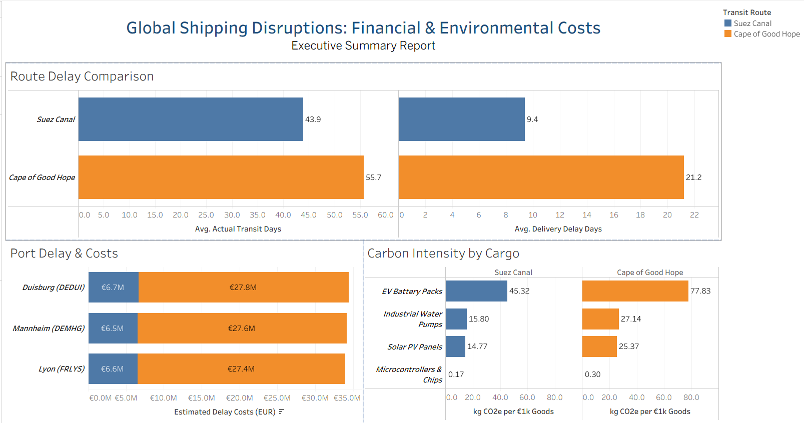

[](https://github.com/NMahmood65/emea_supply_chain_ae/actions/workflows/ci_pipeline.yml)

## Project Overview

Global supply chains face major disruptions. Recent geopolitical conflicts in the Red Sea forced container ships traveling between Asia and Europe to avoid the Suez Canal shortcut and take a long detour around Africa's Cape of Good Hope. This detour adds roughly 12 to 14 days to shipping schedules, delays customer deliveries, increases port congestion, and significantly drives up carbon emissions.

This project builds a modern, automated data system that models this real-world scenario across **500,000 container shipment events**. It processes raw shipment records, cleans messy operational tracking, calculates accurate Scope 3 transport carbon emissions, and ensures that every business report is verified for accuracy.

---

## The Journey: How Data Moves (The Medallion Architecture)

```text
[Raw Dispatches & Telemetry] (Bronze)
              |
              v
[Standardized & Cleaned Views] (Staging)
              |
              v
[Route Splitting & Carbon Logic] (Intermediate / Silver)
              |
              v
[Business-Ready Dashboards & Metrics] (Marts / Gold)

```

## Step-by-Step Breakdown of the Pipeline

### Stage 1: The Raw Data Landing (Bronze Layer)

* **What it represents:** The real-world messy data coming straight from factories, carriers, and ocean container sensors.
* **What we did:** Generated 50,000 realistic purchase orders and 450,000 container status milestones. These records include suppliers in China, India, and Vietnam shipping industrial machinery, solar panels, and EV batteries into European ports (Rotterdam, Antwerp, Hamburg).
* **Quality Check:** We added **data freshness rules** to make sure our system alerts us if incoming tracking data stops flowing or becomes stale.

---

### Stage 2: Cleaning and Standardizing (Staging Layer)

* **What it represents:** Translating messy raw inputs into a clean, uniform company-wide language.
* **What we did:** Converted raw container events and orders into structured views. We corrected date timestamps, calculated how many hours carrier sensors lagged before reporting an update, and converted container weights into metric tonnes.
* **Catching Errors Early:** Our automated tests discovered that some suppliers were shipping from ports that were not yet in our reference directory. The system flagged this missing data immediately, allowing us to update the reference table before bad data corrupted downstream financial and logistical reports.

---

### Stage 3: Untangling the Journey (Intermediate / Silver Layer)

* **What it represents:** Connecting the individual pieces of a shipment's life story.
* **What we did:** 
  1. **Lifecycle Tracking:** Because container updates often arrive out of sequence, we reconstructed each container's exact chronological journey step-by-step. We flagged whether a container was stuck waiting at a port terminal for too long (>5 days) and whether the ship rerouted around Africa.
  2. **Leg Splitting & Emissions:** We split each shipment into two distinct transport phases:
     * **Phase 1 (Ocean):** Asian factory port to a European gateway port (11,000 km via Suez vs. 19,500 km via the Cape detour).
     * **Phase 2 (Inland Rail):** European seaport to the customer's inland distribution warehouse.
  3. **Standardized Carbon Math:** We applied official Global Logistics Emissions Council (GLEC) carbon formulas to compute the exact carbon footprint (tCO2e) generated by each individual leg.

---

### Stage 4: Executive Business Tables (Gold Marts Layer)

* **What it represents:** Clean, fast, ready-to-use tables tailored for supply chain managers, logistics directors, and sustainability teams.
* **What we did:**
  * **Locations Directory (`dim_hubs`):** An authoritative reference list containing port names, countries, and GPS coordinates.
  * **Fulfillment & Carbon Ledger (`fct_shipment_carbon_reconciliation`):** A table where every purchase order brings together actual delivery delays, detour flags, and total greenhouse gas emissions.

---

### Stage 5: The Semantic Layer (Single Source of Truth)

* **What it represents:** Standardized business definitions that prevent different teams from reporting conflicting metrics.
* **What we did:** Defined uniform metrics and an operational time calendar:
  * **Cape Reroute Diversion Rate:** What percentage of our fleet had to bypass the Red Sea?
  * **Carbon Intensity:** Exactly how many tonnes of greenhouse gas were emitted per metric tonne of goods delivered?
  * Regardless of which BI tool or business unit queries the data, everyone receives identical numbers.

---

### Stage 6: Full Pipeline Verification

* We ran the complete pipeline from scratch.
* The system processed all 500,000 records, built every analytical model, and verified all 24 schema tests—passing 100% of data integrity checks in under 6 seconds.

---

### Stage 7: Automated Safety Guardrails (CI/CD)

* **What it represents:** An automated inspection gate for data code.
* **What we did:** Created a GitHub Actions workflow. Whenever an engineer suggests a change or improvement to the code, the cloud test runner automatically spins up the pipeline, generates test data, runs all 24 data tests, and validates that nothing breaks before changes are allowed into production.

---

## 📊 Executive Reporting & Dashboards

To translate raw shipping telemetry into executive decisions, this project feeds data into two analytical deliverables: an **Excel Financial Risk Model** and an **Interactive Tableau Executive Briefing**.

* **Live Interactive Dashboard:** [View on Tableau Public](https://public.tableau.com/app/profile/naser.mahmood/viz/GlobalShippingDisruptionsCosts/ExecutiveSupplyChainBriefing?publish=yes)

### Key Disruption Findings

* **65% of Fleet Diverted:** Nearly two-thirds of ships were rerouted away from the Red Sea around the Cape of Good Hope.
* **+11.8 Extra Days at Sea:** Detours extended transit times from 43.9 days to 55.7 days, pushing average delivery delays past three weeks (21.2 days).
* **€82.8M in Late Fees:** Port congestion and container dwell generated over €82.8 million in detention fees across core European rail and river terminals (Duisburg, Mannheim, and Lyon).
* **+230% Carbon Tax Exposure:** Slower, longer voyages more than tripled emissions, creating an estimated €87.8 million in incremental environmental compliance costs under EU ETS regulations.
* **High-Risk Cargo:** Electric vehicle (EV) battery shipments saw emissions intensity surge from 45.3 kg to 77.8 kg of CO2e per €1,000 of goods.

## Key Business Insights Delivered

1. **True Cost of Disruption:** Quantifies the average delay in transit days caused by geopolitical diversions.
2. **Auditable ESG Reporting:** Provides auditable, shipment-level carbon emission accounting compliant with the GLEC standard.
3. **Port Bottlenecks:** Pinpoints which destination ports cause prolonged container dwell time, helping renegotiate carrier SLAs and prevent expensive terminal storage fees.

---

## 📸 Executive Dashboard Preview

Below is the executive control tower built in Tableau Public, summarizing operational delays, demurrage costs, and carbon intensity by cargo type:



> **Interactive Version:** Explore the live dashboard and filter by route and hub on [Tableau Public](YOUR_TABLEAU_PUBLIC_LINK_HERE).

---

## 💡 Strategic Recommendations for Leadership

1. **Renegotiate Detention Free Time:** Extend free-dwell agreements with ocean carriers on Cape corridors to protect against unbudgeted port storage fees.
2. **Inland Hub Rerouting:** Shift rail and barge transport toward Southern European railheads to bypass congestion in northern freight terminals.
3. **Decouple Battery Supply Chains:** Prioritize local European assembly for heavy, high-value components (like EV batteries) to insulate emissions from Red Sea chokepoints.

---

## 🚀 How to Run This Project Locally

To run the transformation pipeline and reproduce the datasets on your own machine:

### 1. Prerequisites
Ensure you have the following installed:
* [Python 3.10+](https://www.python.org/)
* [Git](https://git-scm.com/)

### 2. Clone the Repository
```bash
git clone https://github.com/NMahmood65/emea_supply_chain_ae.git
cd emea_supply_chain_ae
